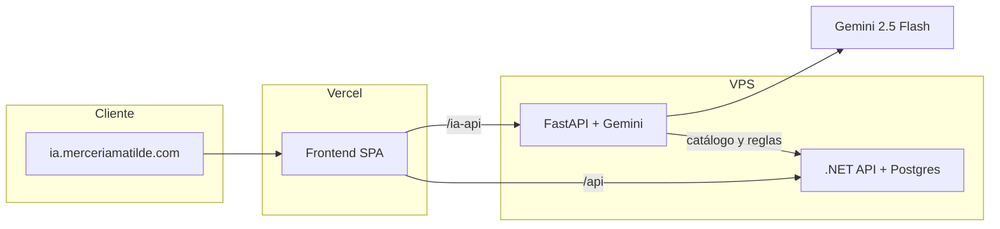
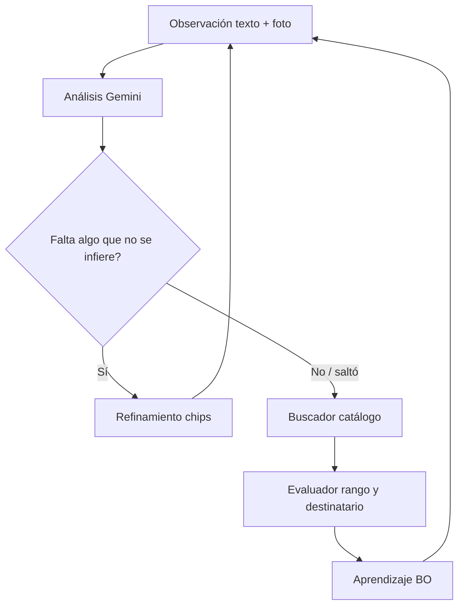
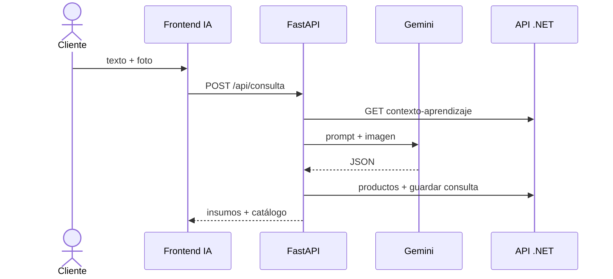

# Diagramas — Entrega final Matilde.IA

## Arquitectura

```mermaid
flowchart LR
  subgraph Cliente
    UI[ia.merceriamatilde.com]
  end
  subgraph Vercel
    FE[Frontend SPA]
  end
  subgraph VPS["VPS"]
    IA[FastAPI + Gemini]
    API[.NET API + Postgres]
  end
  Gemini[Gemini 2.5 Flash]
  UI --> FE
  FE -->|/ia-api| IA
  IA --> Gemini
  IA -->|catálogo y reglas| API
  FE -->|/api| API
```

## Ciclo de agentes

```mermaid
flowchart TD
  O[Observación texto + foto] --> A[Análisis Gemini]
  A --> P{Falta algo que no se infiere?}
  P -->|Sí| R[Refinamiento chips]
  R --> O
  P -->|No / saltó| B[Buscador catálogo]
  B --> E[Evaluador rango y destinatario]
  E --> L[Aprendizaje BO]
  L --> O
```

## Secuencia caso bufanda

```mermaid
sequenceDiagram
  actor C as Cliente
  participant UI as Frontend IA
  participant IA as FastAPI
  participant G as Gemini
  participant API as API .NET
  C->>UI: texto + foto
  UI->>IA: POST /api/consulta
  IA->>API: GET contexto-aprendizaje
  IA->>G: prompt + imagen
  G-->>IA: JSON
  IA->>API: productos + guardar consulta
  IA-->>UI: insumos + catálogo
```
